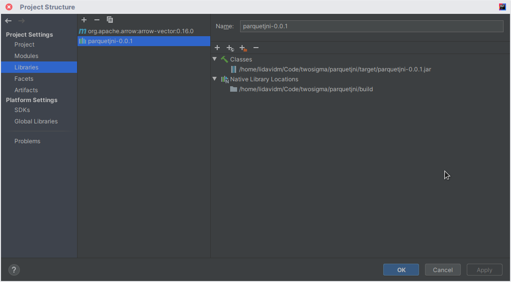

..
  Copyright 2020 Two Sigma Investments, LP.

  Licensed under the Apache License, Version 2.0 (the "License");
  you may not use this file except in compliance with the License.
  You may obtain a copy of the License at

      https://www.apache.org/licenses/LICENSE-2.0

  Unless required by applicable law or agreed to in writing, software
  distributed under the License is distributed on an "AS IS" BASIS,
  WITHOUT WARRANTIES OR CONDITIONS OF ANY KIND, either express or implied.
  See the License for the specific language governing permissions and
  limitations under the License.

============
 parquetjni
============

Building
========

#. First, install the developer prerequisites for Apache Arrow:

   - A C++ compiler
   - JDK8 or higher
   - Maven
   - CMake
   - Conda

   See the instructions on the `Arrow website`_.

#. Let's build a development copy of Arrow.

   For now, we'll be using this fork. After PARQUET-1698 is merged, we
   can use the upstream copy.

   .. code-block:: shell

      git clone https://github.com/lidavidm/arrow
      cd arrow
      git checkout -b parquet-1698-coalesce-reads origin/parquet-1698-coalesce-reads

#. We'll be using Conda to manage developer dependencies. Even though
   this is not a Python project, Conda simplifies the process for
   different platforms.

   .. code-block:: shell

      # From the Arrow repository root
      conda create -n arrow python=3.7 --file ci/conda_env_cpp.yml -c conda-forge
      # Make this environment the active environment
      conda activate arrow

   Make sure to have this Conda environment active while doing
   development.

#. Now let's build Arrow. Take note of places where you'll have to
   substitute in your own paths below!

   .. code-block:: shell

      # From the Arrow repository root
      # Make sure the Conda environment is active!

      # One-time setup steps
      mkdir build
      cd build

      # Re-run whenever you rebase/change branches
      cmake \
          ../cpp \
          -DARROW_DEPENDENCY_SOURCE=CONDA \
          -DCMAKE_BUILD_TYPE=DEBUG \
          -DCMAKE_INSTALL_PREFIX=/PATH/TO/REPOSITORY/ROOT \
          -DCMAKE_INSTALL_LIBDIR=lib \
          -DARROW_DATASET=ON \
          -DARROW_FILESYSTEM=ON \
          -DARROW_PARQUET=ON \
          -DARROW_COMPUTE=OFF \
          -DARROW_CSV=OFF \
          -DARROW_FLIGHT=OFF \
          -DARROW_PYTHON=OFF \
          -DARROW_S3=OFF \
          -DARROW_BUILD_BENCHMARKS=OFF \
          -DARROW_BUILD_INTEGRATION=OFF \
          -DARROW_BUILD_TESTS=OFF

      # Re-run to rebuild the project
      # NOTE: this can be quite memory-hungry! You can limit parallelism
      # by taking off -j or passing an explicit number of parallel tasks
      # (e.g. -j2 to build 2 things in parallel)
      make -j install

   You should see artifacts in ``/PATH/TO/REPOSITORY/ROOT/lib``.

#. Now let's build ParquetJNI.

   .. code-block:: bash

      # From the ParquetJNI repository root
      # Make sure the Conda environment is active!

      # One-time setup steps
      mkdir build
      cd build

      # Re-run whenever you rebase/change branches

      cmake .. \
          -DJAVA_HOME=/PATH/TO/JDK/ROOT \
          -DArrow_DIR=/PATH/TO/ARROW/REPOSITORY/lib/cmake/arrow \
          -DParquet_DIR=/PATH/TO/ARROW/REPOSITORY/lib/cmake/arrow \
          -DGLOG_INCLUDE_DIRS=$CONDA_PREFIX/include \
          -DGLOG_LINK_DIRS=$CONDA_PREFIX/lib \
          -DAWSSDK_INCLUDE_DIRS=$CONDA_PREFIX/include \
          -DAWSSDK_LINK_DIRS=$CONDA_PREFIX/lib

      # Re-run to rebuild the C++ bits of the project
      make -j

      # From the ParquetJNI the repository root
      # Re-run to rebuild the Java bits of the project
      mvn package -Dparquetjni.cpp.build.dir=$(pwd)/build/

   You should find ``parquetjni-0.0.1.jar`` in ``target/`` under the
   ParquetJNI repository root.

Development
===========

This is a Maven project and should be importable into IntelliJ.

For example, see "Project Structure > Libraries" window where a Maven
IntelliJ project is depending on the local ParquetJNI project:

.. _Arrow website: https://arrow.apache.org/docs/developers/cpp/building.html
